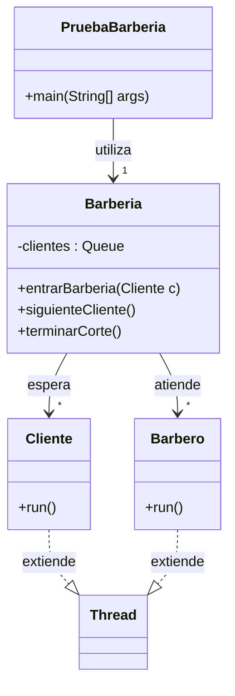

### Introducción 📚
En esta práctica vamos a adentrarnos en el divertido mundo de la concurrencia en Java mediante el desarrollo de una simulación de una barbería. En esta barbería, los clientes llegan en momentos aleatorios buscando un corte de pelo, mientras que los barberos deben gestionar su atención eficientemente para no dejar a ningún cliente esperando demasiado tiempo. Utilizaremos el concepto de hebras para representar tanto a los clientes como a los barberos, y los monitores para gestionar el acceso a los recursos compartidos.

### Objetivos 🎯
- **Comprender y aplicar concurrencia en Java**: Aprenderás cómo gestionar múltiples hebras para simular situaciones de la vida real.
- **Implementar hebras y monitores**: Usarás hebras para representar a los clientes y barberos, y un monitor para gestionar la barbería.
- **Sincronización y comunicación entre hebras**: Asegurarte de que las hebras interactúan entre sí de manera coordinada para que la simulación funcione correctamente.

### Diagrama de Clases 📊

### Clases y sus Roles 🎭
- **Clases que son hebras**:
  - `Cliente`: Representa a los clientes que entran a la barbería. Es una hebra porque simula la acción independiente de cada cliente que llega.
  - `Barbero`: Simula a los barberos trabajando. Como los clientes, cada barbero es una hebra operando de manera concurrente.

- **Clase que es monitor**:
  - `Barberia`: Actúa como un monitor, gestionando la lógica de cuándo un cliente es atendido y cuándo un barbero está disponible para cortar el pelo.

¡Espero que disfrutes implementando esta simulación y aprendas mucho sobre la concurrencia, las hebras y los monitores en Java! 😄